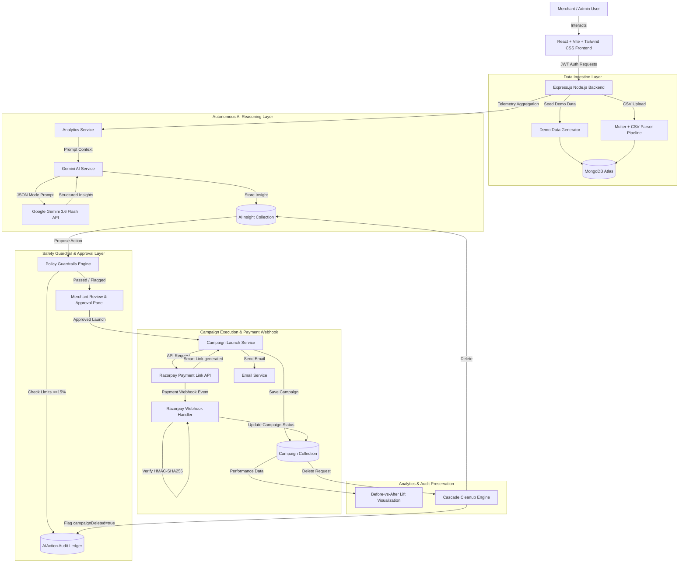
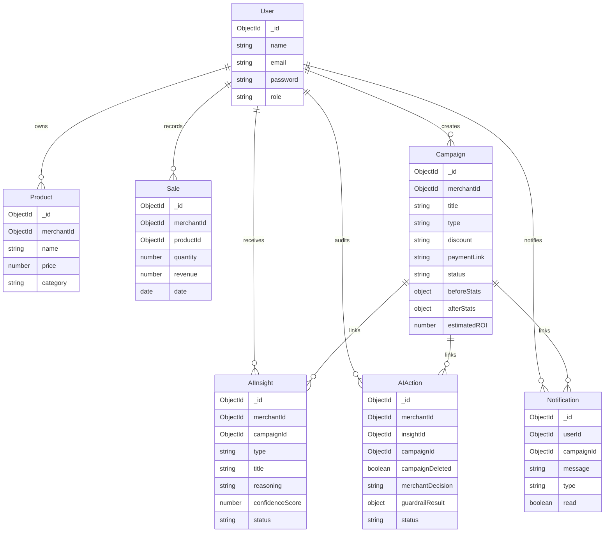

# MerchantAI – End-to-End Workflows, Integrations & Feature Architecture Guide

> **MerchantAI** is an autonomous AI Growth & Agentic Commerce Platform. Instead of acting as a passive chatbot, MerchantAI acts as an agentic partner: it analyzes historical checkout transaction logs, ingests CSV sales data, detects revenue leakages and product co-purchase opportunities, proposes validation-tested discount campaigns, enforces merchant guardrail limits, waits for merchant approval, executes approved campaigns, generates Razorpay checkout smart links, and tracks live campaign lift analytics.

---

## 🏗️ 1. High-Level System Architecture & Flow

---

## 🔄 2. End-to-End Workflow Breakdown

### Workflow 1: Authentication & Merchant Workspace Management
- **Description**: Secure, token-based authentication gating access to merchant workspaces and administrative functionality.
- **Components**: `authRoutes.js`, `authController.js`, `authMiddleware.js`, `AuthContext.jsx`.
- **Flow**:
  1. User registers or logs in via `POST /api/auth/login`.
  2. Server verifies password hash (bcrypt) and issues a signed JSON Web Token (JWT).
  3. Frontend stores JWT in `localStorage` and injects `Authorization: Bearer <token>` into all Axios requests.
  4. Backend middleware (`protect`, `admin`) validates token integrity and attaches `req.user` context.

---

### Workflow 2: Dual Data Input System (Demo Seed + CSV File Import)
- **Description**: Allows merchants to quickly populate transaction telemetry either via mock demo data or by uploading real merchant CSV sales logs.
- **Components**: `dataRoutes.js`, `dataController.js`, `dataImportService.js`, `DataImportSection.jsx`.
- **Flow**:
  1. **Option A (Demo Seed)**: Admin clicks "Load Demo Data" (`POST /api/data/seed`). The backend generates 15 high-fidelity products and 500+ sales transactions across 30 days.
  2. **Option B (CSV File Import)**: Admin uploads a sales CSV (`POST /api/data/import`).
     - Memory storage using `multer` handles file streaming without creating temporary disk files.
     - `csv-parser` streams rows, verifying required columns (`productName`, `price`, `quantity`, `date`).
     - Performs row-level validation (positive prices/quantities, valid ISO dates).
     - Valid rows are bulk-inserted via `bulkImportMerchantSales`, automatically resolving duplicate product catalog entries.
     - Invalid rows are skipped without failing the batch; an expandable error summary is returned to the UI.

---

### Workflow 3: Autonomous Telemetry Analysis & AI Opportunity Detection
- **Description**: Periodically or on-demand, the system scans telemetry to find revenue bottlenecks, slow-moving items, and co-purchase patterns.
- **Components**: `aiRoutes.js`, `aiController.js`, `growthAgentService.js`, `geminiService.js`, `InsightCard.jsx`.
- **Flow**:
  1. User clicks **Detect Opportunities** (`POST /api/ai/analyze`).
  2. `analyticsService.js` compiles a summary of total revenue, order counts, product performance, and sales velocity over 30 days.
  3. Context payload is sent to `geminiService.js`, querying the **Google Gemini 3.6 Flash API** with structured JSON output requirements.
  4. Gemini returns structured recommendations containing:
     - `title` & `type` (e.g., `SLOW_MOVING`, `PRODUCT_BUNDLE`, `SALES_TREND`).
     - `detectedIssue` & `recommendation`.
     - `confidenceScore` (0.0 to 1.0).
     - `reasoning` (AI decision rationale).
     - `expectedImpact` (e.g., `15-20% revenue increase`).
     - `suggestedAction` (discount details, marketing copy).
  5. The opportunity is saved to MongoDB in `AIInsight` and cached in `localStorage` with a 1-hour TTL.

---

### Workflow 4: Policy Guardrails & Safety Verification
- **Description**: Ensures AI-suggested campaigns do not cut too deep into merchant margins or violate promotional safety policies.
- **Components**: `guardrailService.js`, `AIAction.js`.
- **Flow**:
  1. Before an opportunity is rendered for execution, it passes through `validateCampaignGuardrails()`.
  2. **Rules Checked**:
     - Maximum discount cap: `15%`.
     - Maximum duration cap: `30 days`.
     - Non-empty promotional title and marketing copy.
  3. If a merchant attempts to edit a discount to 20%, the system returns `valid: false` with reason `"Discount percentage cannot exceed 15%"`.
  4. An audit record is logged in `AIAction` with status `BLOCKED` and the policy reason.

---

### Workflow 5: Merchant Approval & Smart Link Campaign Execution
- **Description**: Converts approved AI suggestions into live promotional campaigns with automated payment link generation.
- **Components**: `campaignRoutes.js`, `campaignController.js`, `campaignService.js`, `emailService.js`.
- **Flow**:
  1. Merchant clicks **Approve & Launch** on an AI Insight card (`POST /api/campaigns`).
  2. The server creates a `Campaign` document with status `active`.
  3. **Razorpay Smart Link Generation**:
     - Hits Razorpay's `POST /v1/payment_links` API using sandbox credentials.
     - Embeds `reference_id` and metadata notes (`campaign_id`, `campaign_title`, `discount_applied`).
     - Returns a live checkout URL (e.g. `https://rzp.io/i/...`).
  4. **Notifications & Emails**:
     - Creates an in-app notification (`type: campaign_live`).
     - Dispatches an asynchronous email confirmation to the merchant via Nodemailer.
  5. **Audit Ledger Update**: Updates `AIAction` record to `status: EXECUTED` and `merchantDecision: APPROVED`.

---

### Workflow 6: Razorpay Webhook Payment Integration
- **Description**: Real-time event receiver for external payment status updates.
- **Components**: `webhookRoutes.js`, `Campaign.js`, `Notification.js`.
- **Flow**:
  1. Customer completes a transaction using a campaign payment link.
  2. Razorpay sends an HTTP POST request to `/api/webhook/razorpay`.
  3. Server validates signature using HMAC-SHA256 with `RAZORPAY_WEBHOOK_SECRET` and raw request body.
  4. On `payment.captured` or `payment_link.paid` events, extracts `campaign_id` from metadata notes.
  5. Updates campaign revenue/redemption metrics and generates an in-app notification (`type: payment_success`).

---

### Workflow 7: Before-vs-After Lift Analytics & Performance Visualization
- **Description**: Provides visual evidence of campaign effectiveness by comparing performance metrics before and after campaign launch.
- **Components**: `analyticsController.js`, `Campaigns.jsx`, `Recharts`.
- **Flow**:
  1. Upon campaign activation, baseline sales metrics (`beforeStats`: sales count, revenue, conversion rate) are calculated.
  2. Simulated/live performance data (`afterStats`) is updated as orders accumulate.
  3. In `Campaigns.jsx`, clicking **View Lift Analytics** opens a modal containing:
     - Side-by-side Recharts bar charts (Before vs After Revenue & Orders).
     - Calculated metrics: **Estimated ROI %**, **Redemption Count**, and **Lift Percentage**.

---

### Workflow 8: Campaign Cascade Deletion & Audit Trail Preservation
- **Description**: Ensures data consistency when a campaign is deleted without losing historical governance logs.
- **Components**: `campaignController.js`, `AIInsight.js`, `AIAction.js`, `Notification.js`, `AdminPanel.jsx`, `AuditTrail.jsx`.
- **Flow**:
  1. Admin clicks **Delete** on a campaign in `AdminPanel.jsx`.
  2. Confirmation modal warns: *"Deleting this campaign will also remove its associated AI insights. Audit trail history will be preserved."*
  3. `DELETE /api/campaigns/:id` executes cascade cleanup:
     - **Cascade Delete**: Deletes non-actionable `AIInsight` records (`campaignId: id`).
     - **Preserve Audit Trail**: Updates matching `AIAction` records, setting `campaignDeleted: true`.
     - **Notifications Cleanup**: Deletes associated notifications (`campaignId: id`).
     - **Document Deletion**: Removes the `Campaign` document.
  4. Audit Trail view renders a greyed-out `Campaign (deleted)` badge on preserved logs.

---

### Workflow 9: In-App Notification System
- **Description**: Real-time activity feed informing merchants of system events.
- **Components**: `notificationController.js`, `Navbar.jsx`, `Notification.js`.
- **Flow**:
  1. Events (campaign live, payment received, payment failed, new AI insight) trigger `Notification.create()`.
  2. `Navbar.jsx` polls `GET /api/notifications` every 30 seconds.
  3. Unread count badge is displayed on the bell icon.
  4. Clicking "Mark all as read" sends `PATCH /api/notifications/read-all`.

---

## 📊 3. Core Database Models & Schema Relationships

---

## 🌐 4. Complete API Endpoints Reference Table

| Category | Method | Endpoint | Access Level | Description |
|---|---|---|---|---|
| **Auth** | `POST` | `/api/auth/register` | Public | Register a new merchant user |
| **Auth** | `POST` | `/api/auth/login` | Public | Authenticate user & issue JWT |
| **Auth** | `GET` | `/api/auth/profile` | Protected | Fetch current user profile |
| **Data Management** | `POST` | `/api/data/seed` | Protected (Admin) | Seed mock telemetry (15 products, 500+ sales) |
| **Data Management** | `POST` | `/api/data/import` | Protected (Admin) | Ingest CSV sales file (Multer + csv-parser) |
| **Data Management** | `GET` | `/api/data/sample-csv` | Public | Serve sample sales CSV template |
| **AI Agent** | `POST` | `/api/ai/analyze` | Protected | Trigger Gemini 3.6 Flash telemetry analysis |
| **AI Agent** | `GET` | `/api/ai/insights/history` | Protected | Fetch historical AI growth insights |
| **AI Agent** | `POST` | `/api/ai/actions/reject` | Protected | Dismiss an AI opportunity recommendation |
| **AI Agent** | `GET` | `/api/ai/actions` | Protected | Fetch AI action audit trail ledger |
| **Campaigns** | `GET` | `/api/campaigns` | Protected | List all merchant campaigns |
| **Campaigns** | `POST` | `/api/campaigns` | Protected | Launch campaign & generate Razorpay Smart Link |
| **Campaigns** | `DELETE` | `/api/campaigns/:id` | Protected (Admin) | Delete campaign with cascade cleanup & audit preservation |
| **Analytics** | `GET` | `/api/analytics/dashboard` | Protected | Fetch sales metrics & baseline performance data |
| **Notifications** | `GET` | `/api/notifications` | Protected | Fetch current user notifications (limit 20) |
| **Notifications** | `PATCH` | `/api/notifications/:id/read` | Protected | Mark single notification as read |
| **Notifications** | `PATCH` | `/api/notifications/read-all` | Protected | Mark all user notifications as read |
| **Webhooks** | `POST` | `/api/webhook/razorpay` | Public (HMAC Verified) | Process Razorpay payment events |

---

## 🔒 5. Security & Stability Safeguards

1. **Rate Limiting Protection**:
   - `generalLimiter`: 1,000 requests / 15 mins (development) / 100 requests (production).
   - `aiLimiter`: 200 requests / 15 mins (development) / 30 requests (production).
2. **Ephemeral Memory Processing**:
   - Multer uses `memoryStorage()` for CSV parsing, preventing disk artifacts or temporary file leaks.
3. **Webhook Security**:
   - HMAC-SHA256 signature validation on Razorpay webhooks prevents spoofed payment events.
4. **Data Preservation**:
   - Preserves audit trails on campaign deletion (`campaignDeleted: true`) for strict historical governance.
