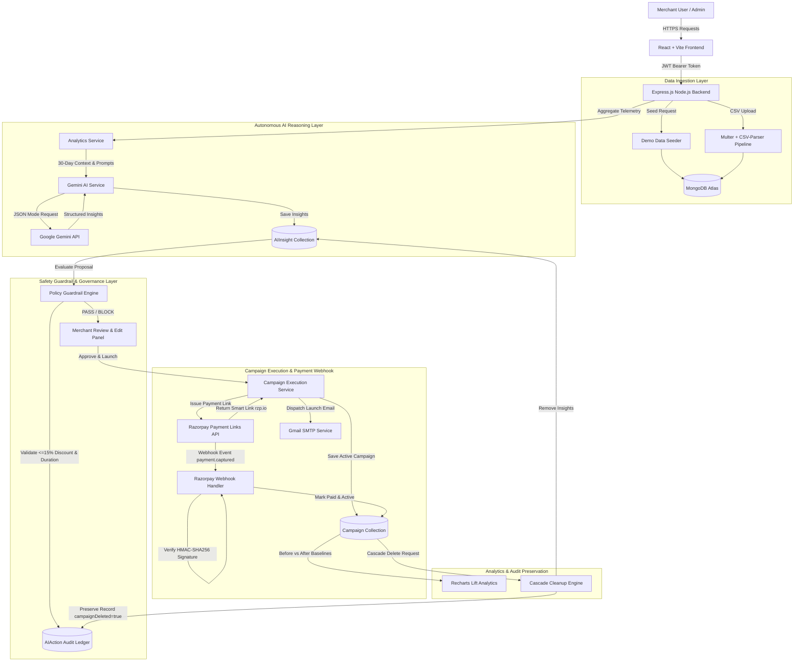

# MerchantAI – AI-Assisted Agentic Commerce Platform

> **MerchantAI** is an AI-assisted agentic commerce platform that discovers merchant growth opportunities, explains its reasoning, enforces safety guardrails, executes merchant-approved campaigns through Razorpay, and measures the resulting impact.

---

## ❓ Problem Statement

Small to medium e-commerce merchants frequently struggle to identify revenue bottlenecks, slow-moving inventory, and co-purchase opportunities hidden within their transaction data due to a lack of time and analytics expertise. Existing solutions either attempt full automation without human oversight—creating financial risk when AI models generate overly aggressive discount promotions—or require complex manual analysis. **MerchantAI** bridges this gap by functioning as an agentic commerce partner that combines autonomous telemetry scanning with unbypassable backend guardrails and human approval.

---

## 🔄 Core Agentic Workflow

The end-to-end operational loop moves through ten structured stages:

```
Merchant Data (Seed / CSV) ➔ AI Opportunity Detection ➔ AI Reasoning & Evidence ➔ Safety Guardrail (<=15%)
                                                                                        │
 Audit Ledger --- Campaign Measurement --- Webhook Confirmation --- Razorpay Execution --- Merchant Decision (Approve / Edit)
```

1. **Merchant Data**: Ingest store catalog and transaction telemetry via instant demo seeding or real CSV file import.
2. **AI Opportunity Detection**: Autonomous Growth Agent aggregates 30-day product velocity, weekend trends, and co-purchase telemetry.
3. **AI Reasoning & Evidence**: Google Gemini API analyzes store performance patterns and generates structured JSON recommendations complete with decision rationale, confidence scores, and expected impacts.
4. **Safety Guardrail**: Unbypassable backend policy engine evaluates proposal constraints ($\le 15\%$ maximum discount, $1\text{--}30$ days duration).
5. **Merchant Decision**: Merchant reviews the recommendation and chooses to approve directly, reject, or edit parameters if flagged by policy limits.
6. **Re-validation**: Server re-validates modified payloads against safety guardrails to ensure edits remain compliant.
7. **Razorpay Execution**: Upon merchant authorization, backend programmatically creates a Razorpay Sandbox Smart Payment Link (`https://rzp.io/i/...`).
8. **Payment / Webhook**: Customer completes checkout; Razorpay posts a webhook event (`payment.captured` / `payment_link.paid`), authenticated via HMAC-SHA256 signature verification.
9. **Campaign Measurement**: System records baseline vs active campaign metrics to measure order lift, revenue increase, and estimated ROI.
10. **Audit Trail**: Governance ledger logs the full decision lifecycle (`PROPOSED` ➔ `BLOCKED` / `APPROVED` ➔ `EDITED` ➔ `EXECUTED`).

---

## ✨ Key Verified Features

All features listed below are fully implemented, verified, and active in the codebase:

- **AI Opportunity Detection with Rationale**: Integrates Google Gemini API (`gemini-1.5-flash`) with structured JSON mode. Provides explicit reasoning text, confidence scores ($0\text{--}100\%$), and expected revenue impact percentages.
- **Unbypassable Backend Guardrails**: Enforces server-side policy limits ($\le 15\%$ maximum discount, $1\text{--}30$ day duration limits, product ownership validation). Re-validated on every merchant edit. Documented policy edge-case verification:
  - `15%` discount ➔ **PASS**
  - `15.1%` discount ➔ **BLOCK**
  - `20%` discount ➔ **BLOCK**
  - `-5%` discount ➔ **BLOCK**
  - `31 days` duration ➔ **BLOCK**
  - `0 days` duration ➔ **BLOCK**
- **Razorpay Sandbox Payment Links & Real Webhooks**: Programmatically creates live payment links via Razorpay API and handles real-time payment confirmation using cryptographic HMAC-SHA256 signature verification.
- **Before-vs-After Campaign Analytics**: Captures baseline pre-campaign metrics (`beforeStats`) upon campaign activation and renders comparative performance lift visualizations via Recharts *(clearly labeled as simulated/demo performance data)*.
- **Full AI Decision Audit Trail**: Complete governance ledger (`AIAction` collection) recording every state transition (`PROPOSED`, `BLOCKED`, `APPROVED`, `REJECTED`, `EXECUTED`), preserving original AI suggestions alongside merchant-edited values.
- **Cascade-Safe Campaign Deletion**: Safely cleans up actionable AI insights and notifications when a campaign is deleted while preserving historical audit logs marked with a `campaignDeleted: true` flag.
- **Dual Data Input Pipeline**: Instant demo data seeder (15 products, 500+ realistic transaction logs) **OR** real CSV sales data import with row-level parsing, type validation, and error reporting.
- **In-App Notification Feed**: Activity feed alerting merchants when campaigns go live, when payment webhooks succeed or fail, and when new AI insights are generated.
- **Role-Based Access Control (RBAC)**: Server-side authorization enforcing separate access tiers for `Merchant` vs `Admin` accounts (`protect` and `admin` middleware).
- **Real SMTP Email Dispatch**: Dispatches HTML email notifications to merchants on campaign launch via Nodemailer and Gmail SMTP integration.
- **Security & Rate Limiting**: Tiered rate limiters (general API vs stricter AI endpoint limits), Helmet HTTP security headers, and JWT authentication with silent token refresh.
- **Production AWS Deployment**: Deployed live on an AWS EC2 instance running Ubuntu, managed via PM2 process manager, configured with an Nginx reverse proxy, and secured with HTTPS via Let's Encrypt (Certbot).

---

## 🛠️ Tech Stack

### Frontend
- **Framework**: React 18, Vite
- **Styling**: Tailwind CSS
- **Data Visualization**: Recharts
- **Icons & UI**: Lucide React, React Hot Toast
- **HTTP Client**: Axios

### Backend
- **Runtime**: Node.js 20.x, Express.js
- **Database**: MongoDB Atlas + Mongoose ODM
- **AI Engine**: Google Gemini API (`gemini-1.5-flash`)
- **Payment Processing**: Razorpay Payment Links API + Razorpay Webhooks
- **Authentication**: JSON Web Tokens (JWT)
- **Supporting Libraries**: `express-validator`, `express-rate-limit`, `helmet`, `multer` (in-memory storage), `csv-parser`, `nodemailer`

### Deployment & Infrastructure
- **Hosting**: AWS EC2 (Ubuntu 24.04 LTS)
- **Web Server & Reverse Proxy**: Nginx
- **Process Manager**: PM2
- **SSL / Security**: Let's Encrypt Certbot (HTTPS)

---

## 📐 Architecture Diagram



---

## 🗄️ Database Schema Overview

- **User**: Represents platform users. Fields include `name`, `email`, `password` (bcrypt hash), `shopName`, `role` (`Merchant` / `Admin`), and timestamps.
- **Product**: Stores catalog products linked to a merchant (`merchantId`, `name`, `price`, `category`).
- **Sale**: Records transaction telemetry (`merchantId`, `productId`, `quantity`, `price`, `date`).
- **Campaign**: Holds active and historical marketing promotions (`merchantId`, `title`, `type`, `discount`, `marketingCopy`, `paymentLink`, `status`, `isPaid`, `paymentStatus`, `paymentId`, `paidAmount`, `paidAt`, `beforeStats`, `afterStats`).
- **AIInsight**: Stores AI-generated growth recommendations (`merchantId`, `campaignId`, `type`, `title`, `reasoning`, `confidenceScore`, `status`).
- **AIAction**: Permanent governance audit trail (`merchantId`, `insightId`, `campaignId`, `campaignDeleted`, `aiRecommendation`, `merchantEdits`, `status`, `result`).
- **Notification**: Real-time user alert messages (`userId`, `campaignId`, `message`, `type`, `isRead`).

---

## 🌐 API Endpoints Reference

| Category | Method | Endpoint | Access Level | Description |
|---|---|---|---|---|
| **Auth** | `POST` | `/api/auth/register` | Public | Register a new merchant user account |
| **Auth** | `POST` | `/api/auth/login` | Public | Authenticate credentials and issue JWT |
| **Auth** | `GET` | `/api/auth/profile` | Protected | Retrieve authenticated user profile |
| **Auth** | `GET` | `/api/auth/users` | Protected (Admin) | List all registered user accounts |
| **Auth** | `DELETE` | `/api/auth/users/:id` | Protected (Admin) | Delete a user account |
| **Data Management** | `POST` | `/api/analytics/demo/load` | Protected (Admin) | Seed mock telemetry (15 products, 500+ sales) |
| **Data Management** | `POST` | `/api/analytics/demo/reset` | Protected (Admin) | Reset database telemetry state |
| **Data Management** | `POST` | `/api/data/import` | Protected (Admin) | Import CSV sales data (Multer + csv-parser) |
| **Data Management** | `GET` | `/api/data/sample-csv` | Public | Download sample CSV sales template |
| **AI Agent** | `GET` | `/api/ai/insights` | Protected | Trigger Gemini AI telemetry analysis |
| **AI Agent** | `GET` | `/api/ai/insights/history` | Protected | Fetch historical AI growth recommendations |
| **AI Agent** | `POST` | `/api/ai/insights/:id/reject` | Protected | Dismiss an AI growth recommendation |
| **AI Agent** | `GET` | `/api/ai/actions` | Protected | Fetch AI governance audit trail logs |
| **AI Agent** | `POST` | `/api/ai/actions/modify` | Protected | Re-validate edited proposal & launch campaign |
| **AI Agent** | `DELETE` | `/api/ai/actions/:id` | Protected (Admin) | Delete an audit trail record |
| **Campaigns** | `GET` | `/api/campaigns` | Protected | List all merchant campaigns |
| **Campaigns** | `POST` | `/api/campaigns` | Protected | Create & launch campaign with Razorpay link |
| **Campaigns** | `GET` | `/api/campaigns/payments` | Protected (Admin) | Fetch administrative payment ledger |
| **Campaigns** | `DELETE` | `/api/campaigns/:id` | Protected (Admin) | Delete campaign with cascade cleanup |
| **Analytics** | `GET` | `/api/analytics/dashboard` | Protected | Fetch store metrics & sales chart data |
| **Dashboard** | `GET` | `/api/dashboard/summary` | Protected | Fetch executive summary metrics |
| **Notifications** | `GET` | `/api/notifications` | Protected | Fetch user notifications (latest 20) |
| **Notifications** | `PATCH` | `/api/notifications/:id/read` | Protected | Mark single notification as read |
| **Notifications** | `PATCH` | `/api/notifications/read-all` | Protected | Mark all user notifications as read |
| **Webhooks** | `POST` | `/api/webhook/razorpay` | Public (HMAC Verified) | Process Razorpay payment events |

---

## 🚀 Setup & Installation Instructions

### Prerequisites
- **Node.js**: `v18.0.0` or higher
- **MongoDB Atlas**: Database cluster connection string
- **Google Gemini API Key**: Google AI Studio API key
- **Razorpay Sandbox Account**: Key ID, Key Secret, and Webhook Secret
- **SMTP Credentials**: Gmail app password for email dispatch

### 1. Repository Clone
```bash
git clone https://github.com/Aravinth-aarav/Ai-Sales.git
cd Ai-Sales
```

### 2. Backend Setup
```bash
cd backend
npm install
```
Create a `.env` file inside the `backend/` directory:
```env
PORT=5000
MONGO_URI=your_mongodb_atlas_connection_string
JWT_SECRET=your_jwt_secret_key
RAZORPAY_KEY_ID=your_razorpay_key_id
RAZORPAY_KEY_SECRET=your_razorpay_key_secret
RAZORPAY_WEBHOOK_SECRET=your_razorpay_webhook_secret
GEMINI_API_KEY=your_gemini_api_key
SMTP_HOST=smtp.gmail.com
SMTP_PORT=465
SMTP_USER=your_email@gmail.com
SMTP_PASS=your_gmail_app_password
```
Start the backend server:
```bash
npm run dev
```

### 3. Frontend Setup
```bash
cd ../frontend
npm install
```
Create a `.env` file inside the `frontend/` directory (optional):
```env
VITE_API_BASE_URL=http://localhost:5000
```
Start the frontend development server:
```bash
npm run dev
```
Open `http://localhost:5173/` in your browser.

### 4. Webhook Setup Note
To receive live Razorpay webhook notifications during local development:
1. Expose port `5000` via ngrok: `ngrok http 5000`.
2. Copy your ngrok HTTPS URL (`https://<ngrok-id>.ngrok-free.app/api/webhook/razorpay`).
3. In **Razorpay Dashboard ➔ Settings ➔ Webhooks**, add the endpoint URL, select `payment.captured` and `payment_link.paid` events, and copy your Webhook Secret into `RAZORPAY_WEBHOOK_SECRET`.

---

## 🎬 Live Demo Walkthrough

1. **Landing Page**: Visit `http://localhost:5173/`. Explore the platform pitch, feature cards, and 4-step workflow. Click **Get Started**.
2. **Merchant Login**: Sign in as administrator (`admin@example.com` / `password123`) or register a new merchant account.
3. **Data Ingestion**: Go to **Admin Panel ➔ Data Management** and click **Load Demo Data** (or upload a custom sales CSV file).
4. **Dashboard Telemetry**: View sales charts, top-performing products, revenue totals, and sales count.
5. **Detect Opportunities**: Click **Detect Opportunities**. Gemini analyzes transaction patterns and renders structured recommendations with decision rationale, confidence scores, and expected ROI impact.
6. **Guardrail Enforcement Demo**: Observe that if an AI proposal or custom modification specifies a discount greater than 15%, the system displays **Action Blocked by Policy**.
7. **Merchant Customization**: Click **Custom Edit Options** and adjust the discount down to 10% (or duration to 14 days).
8. **Re-Validation & Launch**: Click **Apply Modifications & Launch**. The backend re-validates the payload, generates a Razorpay Sandbox Smart Payment Link (`https://rzp.io/i/...`), sends a launch email, and marks the campaign active.
9. **Razorpay Payment**: Open the generated payment link or use the in-app payment modal to simulate payment completion via UPI, Card, Netbanking, or QR Code.
10. **Webhook Processing**: Razorpay webhook fires to `/api/webhook/razorpay`, validates the HMAC-SHA256 signature, updates campaign status to `active` & `PAID`, and logs a payment notification.
11. **Lift Analytics**: Click **View Lift Analytics** on any active campaign card to view Before vs After performance lift charts and ROI calculations.
12. **Audit Governance**: Open **AI Audit Trail** to view the recorded lifecycle (`AI Suggested` ➔ `Blocked` ➔ `Merchant Edited` ➔ `Revalidated` ➔ `Executed`).
13. **Payment Ledger & Cascade Cleanup**: Open **Admin Panel** to view the **Payment History** ledger. Delete a campaign to verify cascade removal of actionable insights while audit logs remain preserved with `Campaign (deleted)`.

---

## 🔒 Security Notes

- **Backend-Enforced Policy Guardrails**: Safety rules ($\le 15\%$ max discount, $1\text{--}30$ day duration cap) are evaluated strictly on the backend to prevent API or client-side tampering.
- **Cryptographic Webhook Verification**: Razorpay webhook payloads are authenticated using HMAC-SHA256 signatures over raw request buffers.
- **Endpoint Rate Limiting**: Stricter rate limiters (`aiLimiter`) protect expensive AI endpoints against brute-force or denial-of-service attempts.
- **Input Sanitization**: `express-validator` sanitizes and validates write payloads prior to processing.
- **Security Headers**: Helmet middleware automatically sets HTTP security headers.
- **Server-Side Role Authorization**: Restricted routes check user roles server-side (`admin` middleware returns `403 Forbidden` for unauthorized requests).
- **HTTPS Encryption**: Live server uses Let's Encrypt TLS certificates managed via Certbot and Nginx.

---

## ⚠️ Known Limitations & Scope

- **Razorpay Sandbox Mode**: Integrates with Razorpay Sandbox APIs. No real money transactions take place.
- **Simulated Lift Analytics**: Before vs After performance metrics (`beforeStats` and `afterStats`) are baseline performance models generated upon campaign activation for evaluation and UI visualization purposes.
- **Single-Tenant Deployment**: Built as a single-merchant demonstration application rather than a multi-tenant enterprise SaaS infrastructure.

---

## 🔮 Future Scope

The following features represent prospective roadmap items and are **not** currently implemented:

- **Multi-Tenant Merchant Accounts**: Multi-tenant workspace isolation and automated subscription management.
- **Queue-Based Asynchronous AI Processing**: BullMQ / Redis background worker queues for high-volume AI telemetry processing at scale.
- **Multi-Campaign Comparative Lift Analysis**: A/B testing dashboard comparing performance across multiple active campaigns simultaneously.
