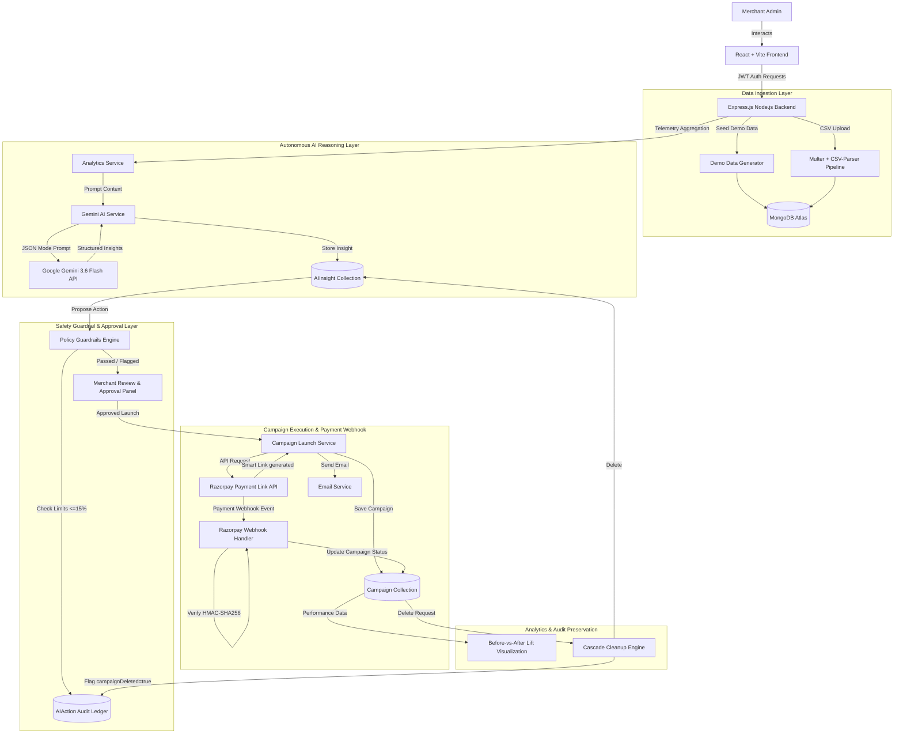

# MerchantAI – AI-Assisted Agentic Commerce Platform

> MerchantAI is an AI-assisted agentic commerce platform that discovers merchant growth opportunities, explains its reasoning, enforces safety guardrails, executes merchant-approved campaigns through Razorpay, and measures the resulting impact.

---

## ❓ Problem Statement

Small to medium e-commerce merchants frequently struggle to identify revenue bottlenecks, slow-moving inventory, and co-purchase opportunities hidden within their transaction data due to lack of time and analytics expertise. Existing solutions either require manual data analysis or attempt full automation without human oversight, creating financial risk when AI algorithms generate overly aggressive discount promotions. MerchantAI bridges this gap by functioning as an agentic commerce partner that combines autonomous telemetry scanning with unbypassable merchant guardrails and human approval.

---

## 🔄 Core Workflow (Agentic Loop)

```
Merchant Data (Seed / CSV) ➔ AI Opportunity Detection ➔ AI Reasoning & Evidence ➔ Safety Guardrail (<=15%)
                                                                                        │
 Audit Ledger --- Campaign Measurement --- Webhook Confirmation --- Razorpay Execution --- Merchant Decision (Approve / Edit)
```

1. **Observe**: Ingest store product catalog and checkout transaction telemetry (via instant seed or CSV upload).
2. **Analyze**: AI Growth Agent aggregates 30-day velocity, weekend trends, and co-purchase patterns.
3. **Recommend**: Google Gemini 3.6 Flash generates structured JSON opportunities with confidence scores and expected impact.
4. **Explain**: Displays user-facing AI reasoning and evidence explaining why the opportunity was detected.
5. **Guardrail**: Backend evaluates safety policies ($\le 15\%$ max discount, $1\text{--}30$ days duration).
6. **Merchant Customize & Re-Validate**: Merchant reviews proposal, edits parameters if blocked/needed, and backend re-validates the modified payload.
7. **Approve & Execute**: Merchant approves campaign; backend programmatically issues a Razorpay Sandbox Smart Payment Link (`https://rzp.io/i/...`).
8. **Payment / Webhook**: Razorpay webhook receives checkout events, verifies HMAC-SHA256 signature, and updates campaign status.
9. **Measure Impact**: Calculates before-vs-after performance baselines and visualizes lift via Recharts.
10. **Audit**: Governance ledger records every state transition (`PROPOSED`, `BLOCKED`, `APPROVED`, `EXECUTED`).

---

## ✨ Key Features (Verified Implemented)

- **AI-Powered Opportunity Detection with Reasoning**: Integrates Google Gemini 3.6 Flash API with structured JSON output, providing confidence scores, expected impact percentages, and concise decision rationale.
- **Unbypassable Backend Guardrails**: Enforces server-side policy limits ($\le 15\%$ discount cap, $1\text{--}30$ day duration limits, product ownership verification). Re-validated on every merchant edit.
- **Razorpay Sandbox Payment Links & Webhooks**: Programmatically creates payment links via Razorpay's API and handles real-time payment notifications via HMAC-SHA256 verified webhooks.
- **Before-vs-After Campaign Analytics**: Captures baseline performance metrics upon campaign activation and renders comparative lift visualizations (clearly labeled as **Demo Campaign Performance**).
- **Comprehensive AI Audit Trail**: Fully traceable ledger logging AI suggestions, original values, merchant edits, guardrail results, and execution timestamps.
- **Cascade-Safe Campaign Deletion**: Deletes non-actionable insights and notifications while preserving historical audit logs marked with `campaignDeleted: true`.
- **Dual Data Input System**: Supports instant demo telemetry seeding (500+ realistic transaction logs) or real CSV sales data import with row-level validation.
- **In-App & Email Notifications**: Real-time activity feed for live campaigns, payment updates, and email dispatch via Nodemailer.
- **Role-Based Authorization**: Enforces strict backend authorization for admin endpoints (`admin` middleware).
- **Security & Rate Limiting**: Separate rate limiters for general routes vs expensive AI endpoints, Helmet security headers, and JWT session gating.

---

## 🛠️ Tech Stack

- **Frontend**: React 18, Vite, Tailwind CSS, Recharts, Lucide React, Axios.
- **Backend**: Node.js, Express.js.
- **Database**: MongoDB Atlas + Mongoose ODM.
- **AI Engine**: Google Gemini API (`gemini-3.6-flash`).
- **Payments**: Razorpay Payment Links API + Razorpay Webhooks.
- **Authentication**: JSON Web Tokens (JWT) with Authorization header gating.
- **Middleware & Utilities**: `express-validator`, `express-rate-limit`, `helmet`, `multer` (in-memory storage), `csv-parser`, `nodemailer`.

---

## 📐 Architecture Diagram



---

## 🗄️ Database Schema Overview

- **User**: Stores merchant credentials, names, emails, roles (`merchant` / `admin`), and password hashes.
- **Product**: Catalog items belonging to a merchant (`merchantId`, `name`, `price`, `category`).
- **Sale**: Historical order transaction telemetry (`merchantId`, `productId`, `quantity`, `revenue`, `date`).
- **Campaign**: Active/past marketing promotions (`merchantId`, `title`, `type`, `discount`, `paymentLink`, `status`, `beforeStats`, `afterStats`).
- **AIInsight**: AI-detected growth recommendations (`merchantId`, `campaignId`, `type`, `title`, `reasoning`, `confidenceScore`, `status`).
- **AIAction**: Permanent audit ledger (`merchantId`, `insightId`, `campaignId`, `campaignDeleted`, `originalAIProposal`, `merchantEditedValues`, `merchantDecision`, `guardrailResult`, `status`).
- **Notification**: User activity feed alerts (`userId`, `campaignId`, `message`, `type`, `read`).

---

## 🌐 API Endpoints Reference

| Category | Method | Endpoint | Access Level | Description |
|---|---|---|---|---|
| **Auth** | `POST` | `/api/auth/register` | Public | Register a new merchant user |
| **Auth** | `POST` | `/api/auth/login` | Public | Authenticate user & issue JWT |
| **Auth** | `GET` | `/api/auth/profile` | Protected | Fetch current user profile |
| **Data Management** | `POST` | `/api/data/seed` | Protected (Admin) | Seed mock telemetry (15 products, 500+ sales) |
| **Data Management** | `POST` | `/api/data/import` | Protected (Admin) | Ingest CSV sales file (Multer + csv-parser) |
| **Data Management** | `GET` | `/api/data/sample-csv` | Public | Serve sample sales CSV template |
| **AI Agent** | `POST` | `/api/ai/analyze` | Protected | Trigger Gemini 3.6 Flash telemetry analysis |
| **AI Agent** | `GET` | `/api/ai/insights/history` | Protected | Fetch historical AI growth insights |
| **AI Agent** | `POST` | `/api/ai/actions/reject` | Protected | Dismiss an AI opportunity recommendation |
| **AI Agent** | `GET` | `/api/ai/actions` | Protected | Fetch AI action audit trail ledger |
| **AI Agent** | `POST` | `/api/ai/actions/modify` | Protected | Submit modified proposal for re-validation & launch |
| **Campaigns** | `GET` | `/api/campaigns` | Protected | List all merchant campaigns |
| **Campaigns** | `POST` | `/api/campaigns` | Protected | Launch campaign & generate Razorpay Smart Link |
| **Campaigns** | `DELETE` | `/api/campaigns/:id` | Protected (Admin) | Delete campaign with cascade cleanup & audit preservation |
| **Analytics** | `GET` | `/api/analytics/dashboard` | Protected | Fetch sales metrics & baseline performance data |
| **Notifications** | `GET` | `/api/notifications` | Protected | Fetch current user notifications (limit 20) |
| **Notifications** | `PATCH` | `/api/notifications/:id/read` | Protected | Mark single notification as read |
| **Notifications** | `PATCH` | `/api/notifications/read-all` | Protected | Mark all user notifications as read |
| **Webhooks** | `POST` | `/api/webhook/razorpay` | Public (HMAC Verified) | Process Razorpay payment events |

---

## 🚀 Setup & Installation Instructions

### Prerequisites
- **Node.js**: v18.0.0 or higher
- **MongoDB Atlas**: Cluster URI connection string
- **Google Gemini API Key**: Google AI Studio API key
- **Razorpay Account**: Sandbox Key ID, Key Secret, and Webhook Secret

### 1. Repository Setup
```bash
git clone https://github.com/Aravinth-aarav/Ai-Sales.git
cd Ai-Sales
```

### 2. Backend Configuration
```bash
cd backend
npm install
```
Create a `.env` file in the `backend/` directory:
```env
PORT=5000
MONGO_URI=your_mongodb_atlas_connection_string
JWT_SECRET=your_jwt_secret_token
GEMINI_API_KEY=your_gemini_api_key
RAZORPAY_KEY_ID=your_razorpay_key_id
RAZORPAY_KEY_SECRET=your_razorpay_key_secret
RAZORPAY_WEBHOOK_SECRET=your_razorpay_webhook_secret
```
Start the backend server:
```bash
npm run dev
```

### 3. Frontend Configuration
```bash
cd ../frontend
npm install
```
Create a `.env` file in the `frontend/` directory (optional):
```env
VITE_API_BASE_URL=http://localhost:5000
```
Start the frontend development server:
```bash
npm run dev
```
Open `http://localhost:5173/` in your browser.

### 4. Webhook Setup Note
To test Razorpay webhooks locally:
1. Expose port `5000` via ngrok: `ngrok http 5000`.
2. Copy your ngrok HTTPS URL (`https://<ngrok-id>.ngrok-free.app/api/webhook/razorpay`).
3. In **Razorpay Dashboard ➔ Settings ➔ Webhooks**, add the endpoint URL, select `payment.captured` / `payment_link.paid`, and set your `RAZORPAY_WEBHOOK_SECRET`.

---

## 🎬 Demo Walkthrough (Buildathon Scenario)

1. **Public Landing Page**: Visit `http://localhost:5173/`. Review hero section, 4 feature cards, and 4-step workflow. Click **Get Started**.
2. **Merchant Login**: Sign in as merchant using `admin@example.com` / `password123`.
3. **Load Demo Data**: In the Data Management section, click **Load Demo Data** to populate 500+ realistic transaction records.
4. **Dashboard Workspace**: Inspect aggregated revenue, order count, sales trends, and top products.
5. **Detect Opportunities**: Click **Detect Opportunities**. Gemini analyzes store data and outputs structured insights with confidence scores and reasoning.
6. **Guardrail Block Demo**: If an AI proposal or custom edit exceeds 15% discount, the UI displays **Action Blocked by Policy**.
7. **Merchant Customization**: Click **Custom Edit Options** and change discount from 20% to 10%.
8. **Re-Validation & Launch**: Click **Apply Modifications & Launch**. Server re-validates payload, generates a Razorpay Sandbox Smart Link (`https://rzp.io/i/...`), and activates campaign.
9. **Simulated Payment**: Click payment options (UPI, Card, Netbanking, QR) to simulate customer checkout.
10. **Webhook Processing**: Razorpay webhook processes `payment.captured`, verifies HMAC signature, and updates campaign state.
11. **View Lift Analytics**: Click **View Lift Analytics** on the active campaign card to view Before vs After Recharts visualization and ROI lift.
12. **Audit Governance**: Open **AI Audit Trail** to view the recorded lifecycle (`AI Suggested` ➔ `Blocked` ➔ `Merchant Edited` ➔ `Revalidated` ➔ `Executed`).
13. **Cascade Deletion**: In Admin Panel, delete a campaign to demonstrate cascade cleanup of insights/notifications while preserving governance logs marked as `Campaign (deleted)`.

---

## 🔒 Security Notes

- **Backend Guardrail Enforcement**: Safety policies ($\le 15\%$ discount cap, $1\text{--}30$ day duration) run strictly on the backend to prevent API or frontend bypass.
- **HMAC-SHA256 Webhook Verification**: Razorpay webhook payloads are authenticated using cryptographic HMAC-SHA256 signatures over the raw request buffer.
- **Rate Limiting**: Endpoint-specific limiters prevent API quota exhaustion (`aiLimiter` on `/api/ai` endpoints).
- **Input Validation**: `express-validator` sanitizes incoming write payloads before business logic execution.
- **Security Headers**: Helmet middleware enables HTTP security headers.
- **Server-Side Authorization**: Admin-only routes are protected server-side with `admin` role middleware (`403 Forbidden`).

---

## ⚠️ Known Limitations & Scope

- **Razorpay Sandbox Mode**: Integrates with Razorpay Sandbox APIs. No live real-world currency is debited.
- **Simulated Lift Telemetry**: Baseline vs active campaign lift numbers are generated once upon campaign activation for evaluation and performance demonstration purposes.
- **Single Deployment Instance**: Built as a single-instance demonstration application rather than a multi-tenant enterprise system.

---

## 🔮 Future Scope

The following features represent future enhancement directions and are **not** currently implemented:
- **Multi-Tenant SaaS Subscriptions**: Automated subscription billing and multi-merchant tenant isolation.
- **Queue-Based Asynchronous AI Processing**: Redis / BullMQ worker queues for asynchronous Gemini batch telemetry processing at scale.
- **Multi-Campaign Comparative Lift Analysis**: Advanced multi-variable campaign A/B testing dashboard.
