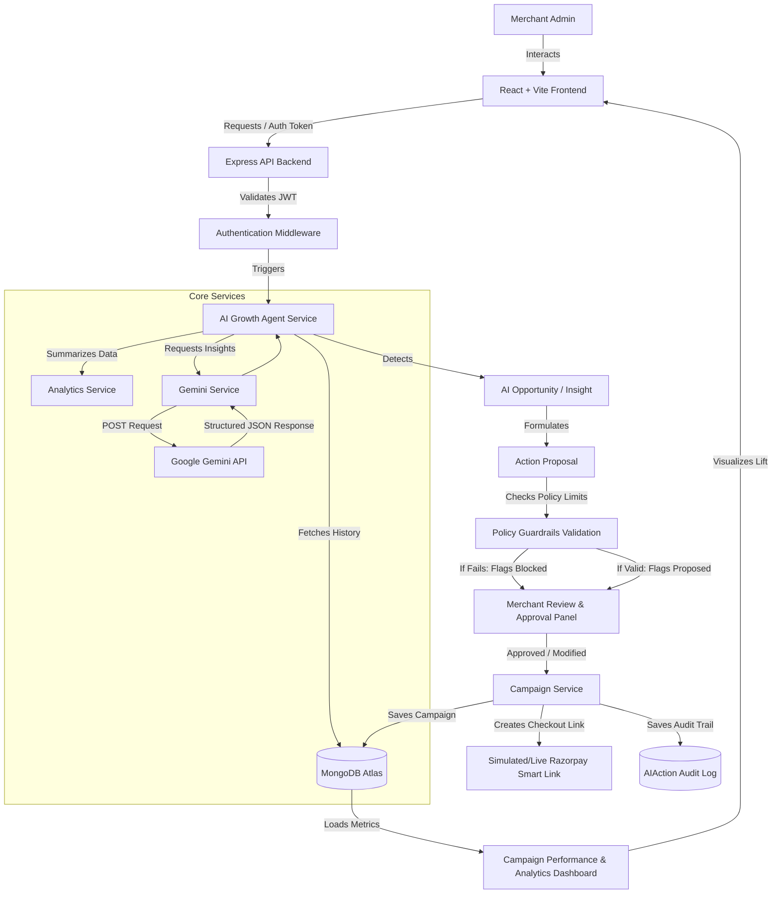

# MerchantAI – AI Growth & Agentic Commerce Assistant
> **Turn merchant data into intelligent growth actions.**

MerchantAI is an **autonomous AI Growth & Agentic Commerce Platform** designed for the Razorpay Buildathon. Instead of acting as a passive chatbot, MerchantAI acts as an agentic partner: it analyzes historical checkout transaction logs, detects revenue leakages and product co-purchase opportunities, proposes validation-tested discount campaigns, enforces merchant guardrail limits, waits for merchant approval, executes the approved campaigns, generates simulated Razorpay checkout smart links, and tracks simulated campaign performance.

---

## 🔄 1. Core Agentic Workflow
```
Observe (Sales logs) → Analyze (Trends) → Recommend (Opportunity) → Validate (Policy) → Approve (Merchant) → Execute (Smart Link) → Measure (Performance)
```

---

## 🎨 2. System Architecture



---

## ✨ 3. Core Features & Polish Additions

* **SaaS Public Landing Page (`/` route)**: A clean, modern public-facing homepage containing:
  * **Hero Section**: Headline ("AI-Powered Campaigns for Smarter Merchants"), subtext, and call-to-action button redirecting to the workspace.
  * **Features Showcase**: Feature cards (AI Suggestions, Secure Payments, Analytics, Admin controls) with `lucide-react` iconography.
  * **How It Works Flow**: Visual 3-step sequence ("1. Add Your Data ➔ 2. AI Suggests Campaign ➔ 3. Approve & Launch").
* **AI Decision Transparency (Reasoning Display)**:
  * Proposes opportunities with structured JSON outputs: suggestion title/type, detected issue, expected impact, confidence score, and **AI Rationale** (`reasoning` field).
  * Prominently displays suggestions on the dashboard card with detailed reasoning and confidence level metrics below.
* **Before-vs-After Lift Analytics**:
  * Generated mock baseline metrics (`beforeStats`) and campaign metrics (`afterStats`) stored directly in the MongoDB campaign record upon activation.
  * Embeds an analytics comparison view with a **Recharts** bar chart comparing Revenue, Orders, and Conversions side-by-side, plus Estimated ROI and Redemption Count cards.
* **Razorpay Webhook Integration**:
  * Exposes an unprotected `/api/webhook/razorpay` endpoint to securely receive checkout event notifications from Razorpay.
  * Uses cryptographic signature verification via HMAC-SHA256 and the raw request body buffer.
  * Extracts the metadata `campaign_id` from incoming payment notes (`payment.captured` or `payment_link.paid`) to automatically update the campaign status to `active` in MongoDB.
* **Policy Guardrails & Prompt Engineering**:
  * Added prompt-level directives constraining Gemini to suggest discount values between `5%` and `15%` by default.
  * Enforces server-side guardrail validations (max 15% discount, max 30-day duration) to block invalid overrides.
* **Responsive Layout Design**:
  * Configured layout grids (`xl:grid-cols-3` in `Dashboard.jsx`) to stack cleanly on medium screens, preventing cramped columns.
  * Implemented maximum heights (`max-h-24`) and vertical scrollbars for long text blocks (detected issue, AI rationale, marketing copy).
  * Retains local user session across page refreshes by preventing destructive redirects during silent refresh checks.

---

## 🛠️ 4. Tech Stack

* **Frontend**: React, Vite, Tailwind CSS v4, Recharts, Lucide Icons, Axios.
* **Backend**: Node.js, Express.js, MongoDB, Mongoose, JSONWebToken, dotenv, Razorpay API.
* **AI Models**: Google Gemini API via official model endpoints (`gemini-3.6-flash`).

---

## 🚀 5. Local Setup

### Prerequisites
* Node.js (v18+)
* MongoDB Atlas Cluster account or Local MongoDB
* Google AI Studio Gemini API Key
* Razorpay Test Mode Key & Secret

### Backend Configuration
1. Open a terminal and navigate to the `backend` directory.
2. Run `npm install` to load dependencies.
3. Create a `.env` file from the placeholder templates:
   ```env
   PORT=5000
   MONGO_URI=your_mongodb_atlas_connection_string
   JWT_SECRET=your_jwt_secret_token
   GEMINI_API_KEY=your_gemini_api_key
   RAZORPAY_KEY_ID=your_razorpay_key_id
   RAZORPAY_KEY_SECRET=your_razorpay_secret_key
   RAZORPAY_WEBHOOK_SECRET=your_razorpay_webhook_secret
   ```
4. Start the backend development server:
   ```bash
   npm run dev
   ```

### Frontend Configuration
1. Open a new terminal and navigate to the `frontend` directory.
2. Run `npm install` to install dependencies.
3. Start the Vite server:
   ```bash
   npm run dev
   ```
4. Access the web app in your browser at `http://localhost:5173/`.

---

## 👨‍⚖️ 6. Demo Judge Evaluation Flow (2-3 Minutes)

1. **Public Homepage**: Start at `http://localhost:5173/` to see the public landing page. Click **Get Started** to go to the login screen.
2. **Login**: Authenticate using credentials `admin@example.com` / `password123` to enter the protected dashboard.
3. **Load Demo Data**: In the sidebar's footer, click **Load Demo Data**. This will generate 500+ transaction records simulating real store analytics (such as low Monday/Tuesday sales and Bluetooth speakers underperforming).
4. **Detect AI Opportunities**: Click **Detect Opportunities** under the AI Growth Agent widget. Wait as it runs through its loading steps:
   - *Aggregating sales metrics...*
   - *Detecting store opportunities...*
   - *Checking policy guardrails...*
5. **Review Action & Guardrails**:
   * Inspect the suggestion, the detected issue, the reasoning, and the AI confidence percentage card.
   * If you try to custom-edit the discount to exceed 15%, the system will block the action and display a guardrail message.
6. **Launch Campaign**: Click **Approve & Launch**. The AI insight transitions to "Launched", generating a payment link.
7. **Verify Active Promotion & Lift Analytics**:
   * Click **Campaigns** in the sidebar. Locate your active campaign.
   * Click **View Lift Analytics** on the card.
   * Check the comparative charts modal (visualizing Before vs After Revenue, Sales, and Conversions) and key performance metrics cards.
8. **View Audit Logs**: Click **AI Audit Trail** in the sidebar to review the full historical ledger of actions proposed, approved, rejected, or blocked.

---

## 🔧 7. What Broke & How We Solved It

### Challenge 1: Tailwind CSS v4 Build Failure
* **What Broke**: The frontend failed to compile due to configuration mismatches between Tailwind CSS v4 styles and PostCSS scripts.
* **Solution**: Migrated standard directives to modern Tailwind `@import "tailwindcss"`, added `@tailwindcss/postcss`, and updated the `postcss.config.js` to compile correctly.

### Challenge 2: Gemini API Model Migration
* **What Broke**: AI suggestions threw a `500 Internal Server Error` due to deprecated model paths.
* **Solution**: Reconfigured the backend `geminiService.js` to point to the current **`gemini-3.6-flash`** API model.

### Challenge 3: Page Navigation State Destruction
* **What Broke**: Clicking away from the Dashboard destroyed the loaded AI recommendation state, forcing users to repeatedly fetch data.
* **Solution**: Implemented **session persistence via localStorage** with 1-hour cache TTL and force-refresh invalidations.

### Challenge 4: Missing Request Parameters on Launch
* **What Broke**: The campaign launch request returned `400 Bad Request` validation errors because `durationDays` was not sent in the default launch payload.
* **Solution**: Updated the frontend payload structure in `InsightCard.jsx` to parse and include `durationDays` matching the express-validator schema rules.

### Challenge 5: AI Discount Exceeding Margins
* **What Broke**: The AI agent occasionally suggested high promotions (like 20-25% off) that cut too deep into merchant operating margins.
* **Solution**: Introduced a backend **Policy Guardrails validation layer** that scans the payload, blocks actions exceeding 15% discount limits, and logs a validation reason.

---

## ⚠️ 8. Known Limitations

* **Simulated Razorpay**: The Razorpay Smart Link is a simulated demo integration (`https://rzp.io/i/pl_XXXX`). No live money is processed.
* **Synthetic Demo Data**: The "Load Demo Data" button creates high-fidelity synthetic transactions for evaluation purposes.
* **Cached Insights**: Saved insights expire after 1 hour (TTL). Merchants can click "Force Refresh" to evict the cache and generate a fresh analysis based on modified checkout data.
